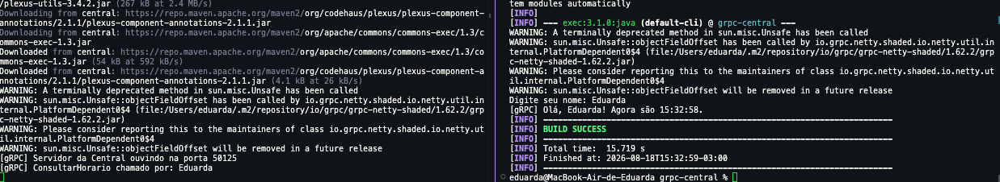
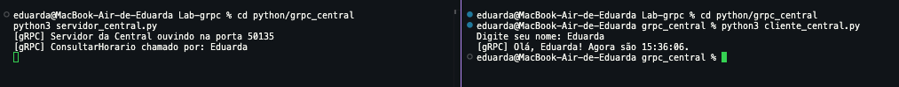
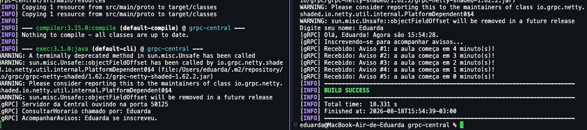
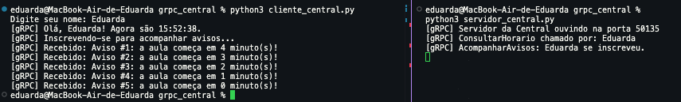

# Central de Atendimento da Turma via gRPC (Lab-grpc)

## 📝 Descrição
Este projeto consiste na implementação de uma central de comunicação distribuída de atendimento da turma utilizando **gRPC** e **Protocol Buffers (protobuf)**. Ele substitui a comunicação direta via sockets do laboratório anterior por uma interface definida por contrato, implementando duas abordagens de comunicação:
1. **Chamada Unária (ConsultarHorario):** Requisição e resposta simples para consulta de horários.
2. **Streaming de Servidor (AcompanharAvisos):** Inscrição em tempo real para recebimento contínuo de avisos publicados pelo servidor.

O sistema possui implementações equivalentes tanto em **Java** quanto em **Python**, demonstrando a interoperabilidade e a independência de linguagem proporcionada pelo ecossistema gRPC.


## 🚀 Tecnologias Utilizadas
- **Linguagens:** Java (JDK 17) e Python (3.10+)
- **Comunicação e Serialização:** gRPC e Protocol Buffers (protobuf)
- **Gerenciador de Dependências:** Maven (Java) e pip (Python)
- **Ferramentas:** Git
- **IA de Apoio:** Este projeto contou com o auxílio de inteligência artificial para otimização e aprendizado:
    - **ChatGPT:** Utilizado para consulta de dúvidas conceituais, resolução de erros específicos e estruturação de lógica.
    - **Antigravity:** Utilizado para auxiliar na escrita de código, refatoração, automação e suporte no desenvolvimento das atividades do laboratório.

---

## 📋 Pré-requisitos
Antes de começar, verifique se você tem instalado:
- **Java JDK 17** ou superior (`java -version`)
- **Maven 3.8+** (`mvn -version`)
- **Python 3.10+** (`python --version`)
- **Git**

---

## 🛠️ Como Executar

### 1. Compilação do Contrato (Protocol Buffers)
O arquivo de contrato formal está em `proto/central.proto`.

#### Em Java (Maven):
O plugin do Maven compila automaticamente o `.proto` ao rodar a fase de compilação:
```bash
cd java/grpc-central
mvn compile
```

#### Em Python:
Gere os stubs de comunicação utilizando as ferramentas do gRPC para Python:
```bash
cd python/grpc_central
pip install grpcio grpcio-tools
python -m grpc_tools.protoc -I ../../proto --python_out=. --grpc_python_out=. ../../proto/central.proto
```

---

### 2. Executando a Aplicação em Java

Abra dois terminais na pasta `java/grpc-central`:

*   **Terminal 1 (Servidor):**
    ```bash
    mvn exec:java -Dexec.mainClass=br.pucminas.labdamd.central.ServidorCentral
    ```
*   **Terminal 2 (Cliente):**
    ```bash
    mvn exec:java -Dexec.mainClass=br.pucminas.labdamd.central.ClienteCentral
    ```

---

### 3. Executando a Aplicação em Python

Abra dois terminais na pasta `python/grpc_central`:

*   **Terminal 1 (Servidor):**
    ```bash
    python servidor_central.py
    ```
*   **Terminal 2 (Cliente):**
    ```bash
    python cliente_central.py
    ```

---

## 📁 Estrutura de Pastas
```text
lab-grpc/
├── proto/
│   └── central.proto
├── java/
│   └── grpc-central/
│       ├── pom.xml
│       └── src/main/java/br/pucminas/labdamd/central/
│           ├── ServidorCentral.java
│           └── ClienteCentral.java
├── python/
│   └── grpc_central/
│       ├── servidor_central.py
│       └── cliente_central.py
├── evidencias/
│   ├── transparencia/
│   ├── unario/
│   └── streaming/
├── RESPOSTAS.md
└── README.md
```


## 📸 Evidências de Execução

### Chamadas Unárias (ConsultarHorario)

#### Java:


#### Python:


### Chamadas com Streaming (AcompanharAvisos)

#### Java:


#### Python:



---

## 👥 Autoria

| 👤 Nome                  | 🖼️ Foto | :octocat: GitHub | 💼 LinkedIn | 📤 Gmail |
| :--- | :---: | :---: | :---: | :---: |
| **Eduarda Vieira Gonçalves** | <div align="center"></div> | <div align="center"><a href="https://github.com/eduardavieira-dev" target="_blank"></a></div> | <div align="center"><a href="https://www.linkedin.com/in/eduarda-vieira-gon%C3%A7alves-01a584297/" target="_blank"></a></div> | <div align="center"><a href="mailto:eduarda.vieira.goncalves7@gmail.com"></a></div> |

---

## 📄 Licença
Este projeto está sob a licença MIT - consulte o arquivo [LICENSE](LICENSE) para mais detalhes.
